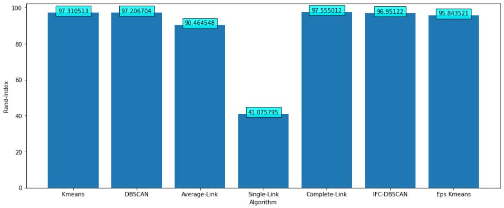

# Introduction to Machine Learning Assignments
Welcome to the repository for the Introduction to Machine Learning course at Ferdowsi University of Mashhad. This repository is a collection of assignments that delve into the fascinating world of machine learning, covering two main components:

## Part 1: Unsupervised Learning
In this section, we explore various clustering algorithms, shedding light on their intricacies and potential. The algorithms implemented in this part include:

### K-Means Clustering
K-Means is a versatile and widely used clustering algorithm that groups data points into clusters based on their similarity.

### DBSCAN (Density-Based Spatial Clustering of Applications with Noise)
DBSCAN is a density-based clustering algorithm that identifies clusters of varying shapes and sizes.

### Average-Link Clustering
Average-Link clustering uses a hierarchical approach, calculating distances between clusters based on the average linkage between their members.

### Single-Link Clustering
Single-Link clustering is another hierarchical algorithm, calculating distances between clusters based on the minimum distances between their members.

### Complete-Link Clustering
Complete-Link clustering, similar to Average-Link, employs a hierarchical approach but calculates distances using the maximum linkage.

### Novel Algorithm Proposals
In addition to these well-known clustering algorithms, we introduce two novel methods to harness their potential:

1. **Iterative Fixed-Cluster DBSCAN**
Iterative Fixed-Cluster DBSCAN fine-tunes the traditional DBSCAN algorithm by running it within a range of epsilon values, ultimately achieving the desired number of clusters.

2. **Epsilon-based KMeans**
Epsilon-based KMeans refines the K-Means algorithm by restricting the choice of neighbors to be within a desired epsilon distance, enhancing its clustering performance.

## Part 2: Perceptron
In this part of the repository, we explore the Perceptron algorithm and its potential for solving binary classification problems. We also demonstrate that by employing a different kernel function instead of the standard linear kernel, we can achieve improved classification results.